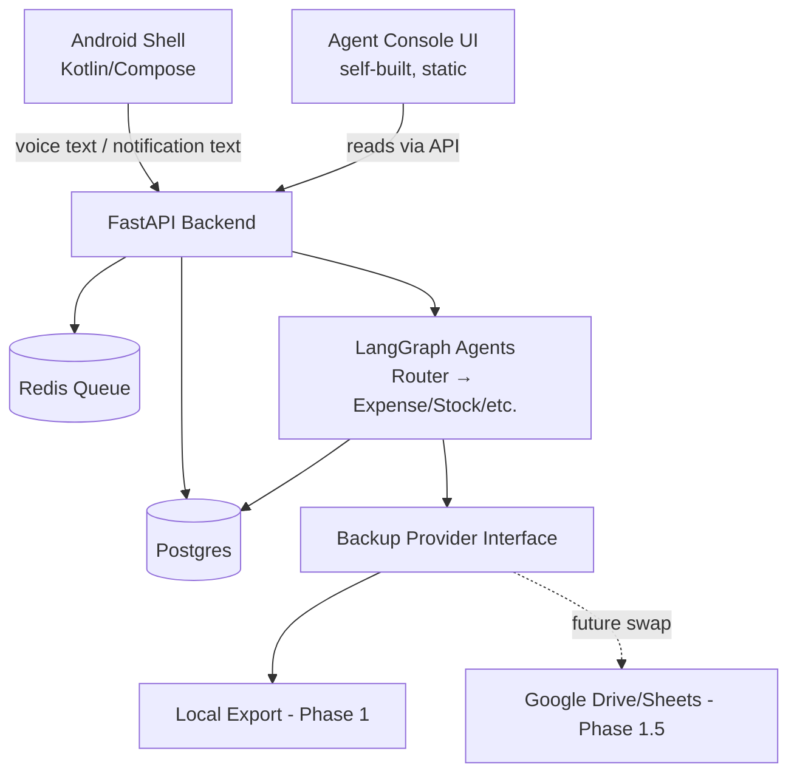

# Master Plan — AI Shell App (hydra-station scope)

**Scope note:** This plan covers only the hydra-station side of the system — the primary backend, agents, and data layer. hydra-pod's reverse-proxy/ingress role and financial-data PII handling are deliberately deferred, as decided earlier; they slot in later without changing anything below.

---

## 1. Architecture at a Glance

Segregation here means **clean module boundaries in code**, not necessarily one container per module. Given the shared-capacity constraint on hydra-station, we consolidate runtime footprint while keeping the codebase cleanly separated — so any piece can still be pulled out into its own container or box later without a rewrite.



**Running containers on hydra-station:** FastAPI, Postgres, Redis. That's it — three, all lightweight, all safe to leave running continuously. No orchestrator container, so no service that needs manual start/stop.

---

## 2. Module A — Android Shell (Client)

Unchanged from earlier: Kotlin + Jetpack Compose, `NotificationListenerService` for bank SMS, native `SpeechRecognizer` for voice, renders Server-Driven UI JSON from the backend. Sends everything to hydra-station's FastAPI over HTTPS.

---

## 3. Module B — Backend + Agent Orchestration (no Flowise/Langflow/n8n)

**Decision:** drop the visual orchestrator entirely. The Router and sub-agents are built with **LangGraph** — the Python library, not a hosted platform — as code living directly inside the FastAPI service.

**Why this is the better fit here:**
- Removes the heaviest, most memory-hungry piece from the whole stack (1–4GB depending on which tool) — the resource budget for the entire backend now comfortably sits well under your reserved ceiling.
- Nothing to start or stop. The agents are just functions the API calls — always available the instant FastAPI is up.
- Real debugging: stack traces, breakpoints, your own IDE/Termux tooling — not a visual canvas.
- You don't lose the learning goal. LangGraph can export the compiled graph as a diagram on demand:
  ```python
  graph.get_graph(xray=True).draw_mermaid()
  ```
  This feeds directly into the Agent Console below.

**Folder structure (logical segregation, physically one service):**
```
backend/
  api/            → FastAPI routes: auth, expenses, stocks, agent-console
  agents/         → router.py, expense_agent.py, stock_agent.py (LangGraph graphs)
  backup/         → provider interface + implementations (see §6)
  db/             → models, migrations
```

---

## 4. Module C — Agent Console (self-built, replaces Flowise/Langflow)

Yes — building this yourself is not only possible, it's the more resource-frugal option, and it's a better match for what you actually wanted (visibility into your own agents, not a general-purpose no-code tool).

**What it is:** a single static page, served directly by FastAPI (`StaticFiles` mount) — no separate container, no extra runtime.

**What it shows:**
- The current agent graph, rendered client-side via `mermaid.js` (CDN) from a `/agent-graph.mmd` endpoint your backend exposes
- A simple table of recent runs: which agent handled a request, input/output, latency, success/failure
- Nothing more — this is a viewer, not an editor. You're not rebuilding a drag-and-drop canvas, just a window into what's already running.

**Build effort:** genuinely small — one HTML file, `mermaid.js` from a CDN, and a couple of read-only FastAPI endpoints (`/agent-graph.mmd`, `/agent-runs`) backed by a `runs` table you already need for debugging anyway.

---

## 5. Module D — Data Layer

- **Postgres:** structured data (expenses, stock trades, users, agent run logs). Add `pgvector` only when you actually need embeddings/AI memory — not needed for the current agent design, so deferred.
- **Redis:** queue for background notification processing (unchanged from earlier plan) — this is also what makes the system safe to run with agents processing asynchronously.

**Every table gets a `user_id` column from day one**, even with a single row in the users table right now. This is the cheap insurance for the "future scaling" goal — retrofitting this after the fact means touching every table and query; building it in now costs nothing.

---

## 6. User & Account Management

```sql
create table users (
  id serial primary key,
  username text unique not null,
  password_hash text not null,
  role text not null default 'user',  -- 'admin' | 'user'
  created_at timestamptz default now()
);
```

- You (JD) are seeded as the sole row, `role = 'admin'`, at first setup.
- Every other table (expenses, stock_trades, agent_runs) carries `user_id references users(id)`.
- Auth: JWT issued on login, standard FastAPI dependency-injection guard on protected routes.
- Admin-gated routes (system config, viewing all agent logs, managing other users if any get added later) check `role == 'admin'` — this is the one place the admin distinction actually matters right now, but the seam exists for whenever it doesn't stay a single-user system.

This satisfies "future scaling: account management" without adding any real overhead today — it's schema and one field, not new infrastructure.

---

## 7. Backup & Export — Google Sheets / Google Drive

**Direct answer: yes, start now — but build the seam, not the Google-specific plumbing, first.**

Wiring live Google OAuth (Cloud project, consent screen, client credentials, token refresh handling) directly into your core data-writing path on day one adds real setup friction before your actual agents even work, and couples your core logic to one specific provider. Instead:

**Step 1 — define the interface now (near-zero cost):**
```python
from typing import Protocol

class BackupProvider(Protocol):
    def export_snapshot(self, data: dict) -> None: ...
    def list_backups(self) -> list[str]: ...
    def restore(self, backup_id: str) -> dict: ...
```

**Step 2 — implement a trivial local provider first:**
`LocalFileBackupProvider` — dumps tables to timestamped JSON in a mounted volume. Zero external setup, validates the interface actually works end-to-end, and is itself a useful backup even before Google is wired in.

**Step 3 — add `GDriveBackupProvider` / `GSheetsBackupProvider` whenever you're ready to spend the OAuth setup time** — same interface, swapped in via one config value (`BACKUP_PROVIDER=gdrive`). Nothing else in the codebase changes.

This gets you exactly what you asked for — zero hassle bolting it on later — without blocking today's build on Google Cloud console setup. Trigger backups on a schedule via `APScheduler` inside the existing FastAPI process; no new service needed for this either.

---

## 8. Resource Budget (hydra-station, revised)

Dropping the orchestrator moves the numbers meaningfully:

| Service     | RAM (typical) | Notes |
|-------------|---------------|-------|
| FastAPI (+ LangGraph + Agent Console) | ~300–500MB | pure Python, no Node.js UI layer |
| Postgres    | ~500MB–1GB    | grows slowly with data volume |
| Redis       | ~50–100MB     | queue only, small dataset |
| **Total**   | **~1–1.6GB**  | vs. 3–4GB+ with Flowise/Langflow in the mix |

Against your reserved 4GB/1-core ceiling for this project, this leaves substantially more headroom for future app development than the original plan — you could comfortably run a second lightweight project on hydra-station without touching this one's budget.

---

## 9. Docker Compose Skeleton

```yaml
services:
  backend:
    build: ./backend
    mem_limit: 768m
    cpus: "0.5"
    depends_on: [postgres, redis]
  postgres:
    image: postgres:16
    mem_limit: 1g
    cpus: "0.3"
  redis:
    image: redis:alpine
    mem_limit: 256m
    cpus: "0.1"
```

---

## 10. Deliberately Out of Scope for This Pass

- hydra-pod reverse-proxy/tunnel setup (separate, already planned — slots in without changes here)
- Financial-data PII stripping before any cloud LLM call (deferred by your earlier call — the backup-provider seam pattern above is the same pattern to apply here whenever you pick it back up)
